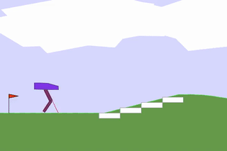

# Bipedal Walker (Soft Actor Critic)

## Videos

    

The first try in which agent chooses actions uniformly at random to enhance the starting point of the buffer. This is done using `action = env.action_space.sample()`.

    

Episode 2925, which has clearly shown that the agent has learned how to walk and doge some edge cases like getting stuck on a small obstacle.
