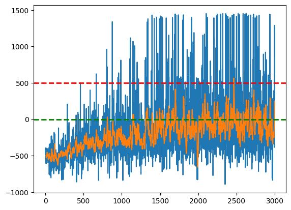

# Bipedal Walker (Soft Actor Critic)

## Results

### Rewards

    

### Alpha

<table align="center">
  <tr>
    <td>
        
    </td>
    <td>
        
    </td>
  </tr>
</table>

## Videos

    

The first try in which agent chooses actions uniformly at random to enhance the starting point of the buffer. This is done using `action = env.action_space.sample()`.

    

Episode 2925, which has clearly shown that the agent has learned how to walk and doge some edge cases like getting stuck on a small obstacle.

    

Finally, the last episode (not necessarily the best performance) shows that the agent has "learnt" something but needs to be trained in the environment more to get better over time.
